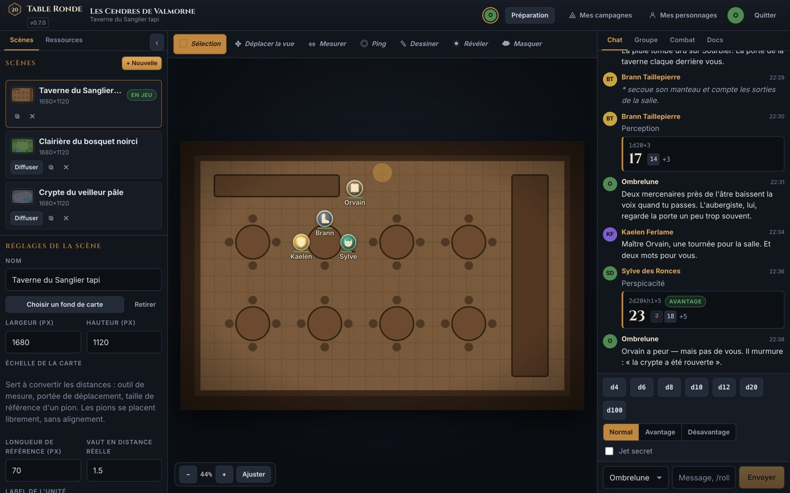
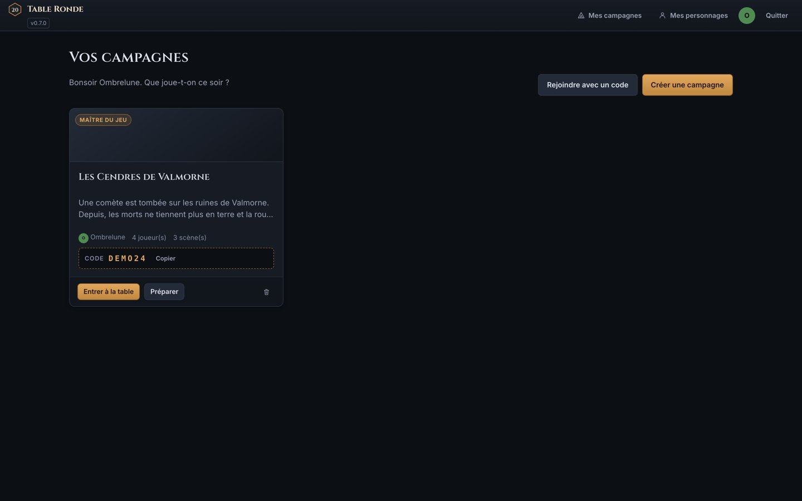
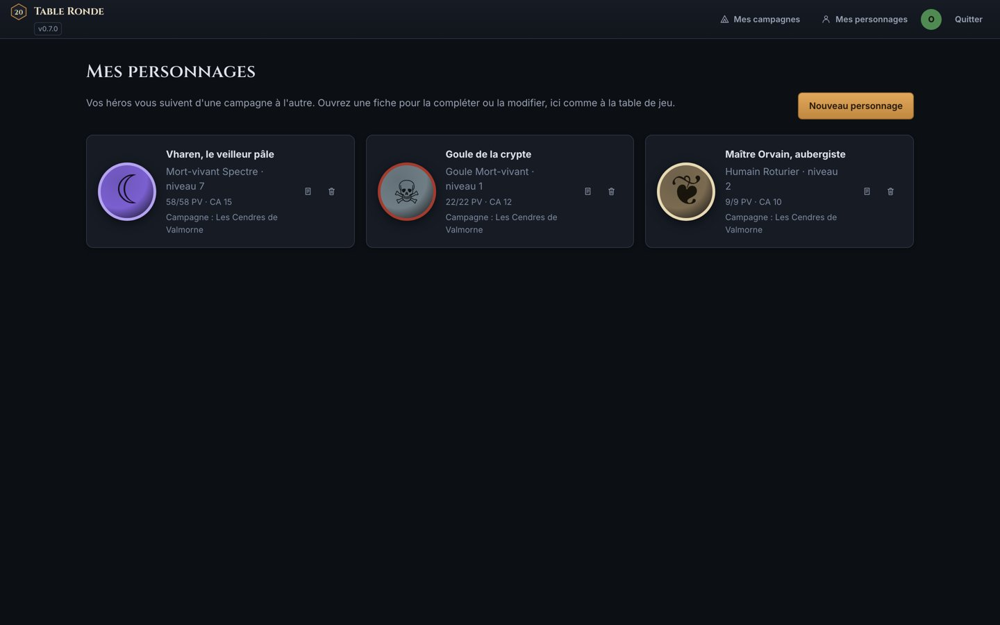

# Table Ronde — table de jeu virtuelle

Une table de jeu virtuelle auto-hébergée, dans l'esprit de Roll20, pensée pour les
sessions de jeu de rôle D&D 5e : cartes avec grille et brouillard de guerre, pions
déplaçables en temps réel, fiches de personnage complètes, espace de préparation
privé pour le Maître du Jeu, chat et jets de dés partagés.

Tout tourne dans Docker : trois conteneurs (PostgreSQL, API Node, interface web
servie par nginx) et deux volumes pour les données et les fichiers téléversés.

---

## Aperçu

*Captures de la campagne de démonstration fournie (`server/prisma/demo.js`) : personnages, cartes et discussions fictifs.*



| Campagnes | Personnages |
| --- | --- |
|  |  |

## Démarrage

```bash
cp .env.example .env      # puis éditez JWT_SECRET et POSTGRES_PASSWORD
docker compose up -d --build
```

L'interface est disponible sur **http://localhost:8080**.

Au premier démarrage, le conteneur `server` crée le schéma de base et installe les
ressources graphiques fournies (16 pions de classe, 5 cadres de portrait,
5 cartes de bataille), le tout généré en SVG — aucune dépendance externe.

### Partie de démonstration

Pour découvrir l'outil avec des données réalistes :

```bash
docker compose exec server node prisma/demo.js
```

Cela crée la campagne **« Les Cendres de Valmorne »** : 3 scènes, 3 personnages
joueurs complets, 3 PNJ, des documents partagés et secrets, un ordre d'initiative
et un historique de chat.

| Rôle | Identifiant |
| --- | --- |
| Maître du Jeu | `mj@demo.fr` |
| Joueur (Paladin) | `kaelen@demo.fr` |
| Joueur (Druide) | `sylve@demo.fr` |
| Joueur (Roublard) | `brann@demo.fr` |

Le script tire un mot de passe commun au hasard et l'affiche en fin
d'exécution — notez-le, il n'est pas réaffiché. Pour en imposer un :
`DEMO_PASSWORD=… docker compose exec server node prisma/demo.js`.

Ces comptes n'ont pas leur place sur une instance ouverte sur Internet : la
démo est faite pour découvrir l'outil en local.

Code d'invitation de la campagne : **DEMO24**

Le script est rejouable : il remet la campagne de démo dans son état initial sans
toucher aux autres campagnes.

---

## Ce que l'outil sait faire

### Pour les joueurs
- **Inscription libre**, puis on rejoint une campagne avec le code à 6 caractères
  donné par le MJ. Tout est sauvegardé : on ferme l'onglet, on revient, la partie
  est là.
- **Fiche de personnage D&D 5e complète** : caractéristiques, sauvegardes,
  18 compétences avec maîtrise et expertise, attaques, sorts et emplacements,
  inventaire et bourse, capacités, histoire. Tous les modificateurs, le bonus de
  maîtrise, le DD des sorts et les valeurs passives sont **calculés côté serveur**.
- **Jets de dés depuis la fiche** : un clic sur un modificateur, une compétence ou
  une attaque lance le dé et l'annonce dans le chat. `Maj` + clic pour un avantage,
  `Ctrl`/`Cmd` + clic pour un désavantage.
- **Pions** : poser son personnage sur la carte en un clic, le déplacer (les autres
  voient le mouvement en direct), gérer ses points de vie et ses états.
- Les personnages **suivent leur propriétaire** d'une campagne à l'autre.

### Pour le Maître du Jeu
- **Espace de préparation** séparé de la table : scènes, PNJ, documents,
  bibliothèque d'images, gestion des joueurs.
- **Scènes multiples** avec fond de carte, grille réglable (taille, décalage,
  opacité, unité de distance), notes privées en Markdown. On choisit quelle scène
  est diffusée aux joueurs ; les autres restent invisibles.
- **Brouillard de guerre** : on révèle ou on remasque des zones au rectangle. Le MJ
  voit à travers en transparence, les joueurs ne voient rien.
- **Pions cachés** et **calque MJ** : préparer l'embuscade à l'avance, la révéler au
  bon moment.
- **PNJ et créatures** avec fiches complètes, invisibles des joueurs.
- **Documents** (notes, indices, illustrations) partageables à toute la table ou à
  un joueur en particulier.
- **Ordre d'initiative** : ajout automatique des pions de la scène, relance groupée
  des initiatives, tour par tour, dégâts rapides.
- **Jets secrets** (`/gmroll`) et chuchotements (`/w Pseudo …`).
- **Co-MJ** : promouvoir un joueur pour qu'il partage les droits du MJ.

### La carte
- Panoramique (clic milieu, `Alt` + glisser, ou outil dédié), zoom à la molette,
  ajustement automatique à l'écran.
- Sélection simple, multiple (`Maj` + clic) et au rectangle.
- Aimantation à la grille, tailles de pion d'une demi-case à quatre cases.
- Nameplates, barres de vie, 16 états D&D avec pictogrammes, auras colorées.
- Outil de **mesure** en unités de la grille, **dessin** partagé (trait libre,
  ligne, rectangle, cercle) avec calque réservé au MJ.
- **Pings** pour attirer l'attention, **curseurs partagés** entre joueurs.

---

## Raccourcis clavier

| Touche | Action |
| --- | --- |
| `V` | Sélection |
| `H` | Déplacer la vue |
| `M` | Mesurer |
| `P` | Ping |
| `D` | Dessiner |
| `R` / `F` | Révéler / masquer le brouillard (MJ) |
| `Suppr` | Retirer les pions sélectionnés |
| `Échap` | Annuler la sélection |

## Syntaxe des dés

Le moteur accepte la notation usuelle des JDR, avec un tirage aléatoire
cryptographique (`crypto.randomBytes`), jamais `Math.random`.

| Exemple | Effet |
| --- | --- |
| `/roll 1d20+5` | Jet classique |
| `/roll 2d20kh1` | Garde le meilleur (avantage) |
| `/roll 2d20kl1` | Garde le pire (désavantage) |
| `/roll 4d6dl1` | Retire le plus faible (génération de caractéristiques) |
| `/roll 8d6!` | Dés explosifs |
| `/roll 2d10r1` | Relance les 1 |
| `/roll 1d8+1d6+3` | Termes multiples |
| `/roll 1d20+7 # Perception` | Jet étiqueté |
| `/gmroll 1d20` | Jet visible du seul MJ |
| `/w Kaelen …` | Chuchotement |
| `/me …` | Emote |
| `/ooc …` | Hors-jeu |

---

## Architecture

```
.
├── docker-compose.yml          # db + server + web
├── docker-compose.dev.yml      # surcharge : rechargement à chaud
├── server/                     # API Node 20 (Express + Socket.IO + Prisma)
│   ├── prisma/schema.prisma    # modèle de données
│   ├── prisma/builtin.js       # génération des ressources SVG fournies
│   ├── prisma/seed.js          # enregistrement des ressources (idempotent)
│   ├── prisma/demo.js          # partie de démonstration
│   └── src/
│       ├── lib/                # env, base, auth, dés, règles D&D
│       ├── routes/             # REST : auth, campagnes, scènes, pions, persos…
│       └── realtime/           # Socket.IO : présence, chat, pions, brouillard
└── web/                        # React 18 + Vite, servi par nginx
    └── src/
        ├── lib/                # client API, socket, état global (zustand)
        ├── components/         # carte, chat, fiche, combat, bibliothèque…
        └── pages/              # connexion, campagnes, table, préparation
```

**Temps réel.** Le déplacement d'un pion est diffusé par WebSocket pendant le
glisser (sans écriture en base), puis la position finale est persistée par un appel
REST. L'affichage est optimiste : l'écran répond avant la confirmation du serveur,
et revient en arrière si celui-ci refuse.

**Séparation MJ / joueurs.** Elle est appliquée **côté serveur**, pas seulement dans
l'interface : les pions invisibles, les notes de scène, les scènes non diffusées,
les PNJ et les documents non partagés ne sont jamais envoyés aux joueurs. Les
événements temps réel passent par des salons distincts (`campaign:<id>` et
`campaign:<id>:gm`).

### Développement

```bash
docker compose -f docker-compose.yml -f docker-compose.dev.yml up
```

L'interface est alors sur http://localhost:5173 (rechargement à chaud) et l'API sur
http://localhost:4000.

---

## Mise en production

Avant d'ouvrir l'outil sur Internet :

1. **`JWT_SECRET`** : une chaîne aléatoire longue et unique. Toute personne qui la
   connaît peut forger des sessions.
   ```bash
   openssl rand -base64 48
   ```
2. **`POSTGRES_PASSWORD`** : à changer également.
3. **`CORS_ORIGINS`** : la liste exacte des domaines servant l'interface.
4. **HTTPS** : placez un reverse proxy (Caddy, Traefik, nginx) devant le service
   `web`. Les WebSockets doivent être relayés (`Upgrade`/`Connection`).
5. **Sauvegardes** : les deux volumes `db_data` et `uploads` contiennent toutes les
   données de jeu.
   ```bash
   docker compose exec db pg_dump -U tabletop tabletop > sauvegarde.sql
   ```

### Choix de sécurité déjà en place

- Mots de passe hachés avec bcrypt (coût 11), jamais renvoyés par l'API.
- Toutes les entrées sont validées par des schémas zod ; les droits sont vérifiés
  à chaque requête, y compris sur les événements WebSocket.
- Les fichiers téléversés sont servis avec
  `Content-Security-Policy: default-src 'none'; sandbox` : un SVG ou un PDF hostile
  ne peut pas s'exécuter dans le contexte de l'application.
- Types MIME et taille des téléversements restreints (25 Mo par défaut).
- Un joueur ne peut déplacer que ses propres pions, et ne peut ni les rendre
  visibles, ni changer leur calque, ni les déverrouiller.

## Licence

Usage privé. D&D et Dungeons & Dragons sont des marques de Wizards of the Coast ;
ce projet est un outil indépendant, sans lien avec l'éditeur.

Le catalogue de sorts (`web/src/lib/spells.js`) s'appuie sur le **System
Reference Document 5.1**, publié par Wizards of the Coast sous licence
[Creative Commons Attribution 4.0](https://creativecommons.org/licenses/by/4.0/).
Les descriptions affichées sont des résumés d'effet rédigés pour cette
application : elles permettent de reconnaître un sort et de décider en jeu, mais
ne remplacent pas le manuel, qui fait foi sur les règles. Les sous-races
proposées suivent les règles de 2014.
